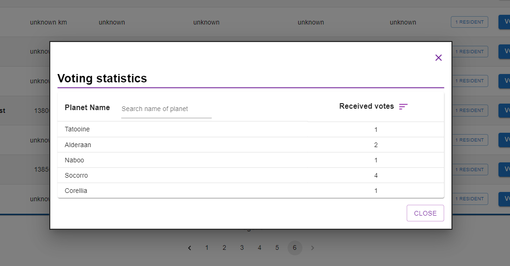

# API Wars

## What is our application about?

This project's aim is to show and handle interconnected data about the Star Wars universe. 
The main page lists all the planets with their different properties. You can also view the residents of each planet in a dedicated modal.  
The application also handles a voting system for the planets where any user can view the current vote statistics. However, the login system only allows registered and logged-in users to vote on the specific planets, so the application also comes with a registration and login page. The logged-in user can not only view the voting statistics but can also list his/her own votes on a separate page.

## Main features and technologies used in ths project

- Node.js and Express backend with different routes, controllers and other middlewares
- Cloud-based NoSQL MongoDb database with persistent data and connected collections
- Different models for the database that are handled using Mongoose.js
- React frontend with routing and clean UI made with MaterialUI components
- Authentication and Authorization with JWT token implemented both on backend and frontend
- Automatic logout on frontend after token expiration
- Pagination
- Filtering and sorting functionality for votes
- Responsive components and collapsive table for mobile view

## Pictures of the application

##### The main page

##### Mobile view of collapsible planets table

##### Modal displaying the voting statistics

